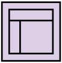
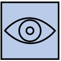

# Feedy UXD

## Abstract

This repository presents the comprehensive approach that went into designing **Feedy**, a mobile application aimed to enhance nutritional care. The app mainly focuses on addressing the challenges of **continuous follow-up** between nutritionists and their patients whilst improving patient adherence to dietary plans.

Within this space there are details of processes, strategies, user experience models, wireframes, mockups, **and more**. All assets created with User Experience (UX) fundamentals in mind.

The book **"The Elements of User Experience (2nd edition)"** by Jesse James Garrett was used as main reference.

## Team and Roles

- Benjamin Salamanca - Designer
  - Responsible on developing the user experience and user interface of the app.
- Nicolás Pacheco - Analyst
  - Focused on analysing and understanding the problem, and in ensuring that the solution is a good fit to effectively solve it.
- Nicolás Fernández - Expositor
  - Responsible of presenting and communicating the app's features and design to stakeholders. 
- Nicolás Paila - Project Manager
  - Responsible in overseeing the project's timeline, scheduling, and team coordination.

##  1. Strategy 

### Problem Statement
One of the most prominent challenges in nutritional care is the lack of **continuous follow-up** between nutritionists and their patients.

In practice, most nutritionists don't have a real-time system to track their patients' progress. Typically, patients are provided with a set of dietary recommendations and nutritional guidelines, but ongoing communication between the professional and the patient is limited to pre-scheduled, in-person consultations.

This situation presents several issues:

- From the **patient's perspective**, there is no immediate way to get assistance or clarification on their dietary plan as challenges or questions arise during the course of treatment.

- From the **nutritionist's perspective**, understanding patient progress is limited to sporadic appointments, making it difficult to gauge how well patients adhere to the prescribed plan or to provide timely adjustments to their treatment

### User needs:

- **Professionals’ perspective:**
  - “I want to know how my patients are progressing.”
  - “I want to know how well my treatments are being followed” → understand adherence to the treatment.
  - “I want to improve the quality of my care.”

- **Patients’ perspective:**
  - “I have a question about my treatment and I don't know how to communicate with my nutritionist.”
  - “I don’t have the ingredient mentioned in my recipe, and I don’t know what would be a good substitute. I want to ask my nutritionist.”

### Identified users:

- **Patients**: People who seek care from nutritionists. The reasons for seeking care include: eating disorders, medical problems with a nutritional origin, starting diets, weight-loss programs, and more.
- **Nutritionists**: Professional doctors who provide healthcare and treatments in the areas of nutrition and dietetics.

### Interview with Nutritionists

As part of the user research process we interviewed two nutritionists on key points related to their day-to-day workflow.

[Interview with Constanza](./assets/1.%20Strategy/Nutritionist%20Interview%20-%20Constanza)

[Interview with Bárbara](./assets/1.%20Strategy/Nutritionist%20Interview%20-%20Barbara)

---

### Solution
The solution is **Feedy**, a digital platform that facilitates continuous communication and tracking between nutritionists and their patients, ensuring more effective treatment follow-ups.

This platform enables nutritionists to manage, monitor, and support their patients throughout their treatment journey. Patients, in turn, can use the platform to log their progress, and stay in touch with their nutritionist, receiving guidance whenever needed.

### Product objectives:

- Enhance continuous monitoring of nutritional treatments
- Simplify patient management for nutritionists
- Increase adherence to nutritional plans

### Value Proposition Canvas

### UX Personas

#### Nutritionist

#### Patients

### Limitations

- There was an original proposal for Feedy that was intented to contain many more functionalities which were hoped to effectively solve the problem. Nevertheless that version was heavily cut in order to fit the project within the course timeframe.
- The solution is in fact a two-system platform, one system designed specifically for nutritionists, and the other specifically for patients. With this in mind, the scope of the project could easily take a huge toll on the time needed for design. Because of this scope creep a scope cut was needed.

##  2. Scope 

### Functional Requirements

A detailed list of the main functionalities the platform aims to provide.

1. **Nutritional Plan Manager**

   - **1.1. Management of nutritional plans**:  
     Nutritionists will be able to create and customize meal plans for their patients. Each plan will include:
     - Specific nutritional requirements (calories, macronutrients, micronutrients, etc).
     - Food and meal recommendations.

   - **1.2. Plan Adjustments and Updates**:  
     Nutritionists can modify existing nutritional plans and send them to patients in real time.

2. **Tracking Tools**

   - **2.1. Daily food intake logging**:  
     Patients can easily record their daily meals either manually or by selecting predefined options within the platform.

3. **Patient Management Module**

   - **3.1. Patient Management**:  
     Nutritionists can view and manage all their patients from a unified control panel. They will have access to information such as:
     - Medical history.
     - Progress in treatment.
     - Latest food intake logs.

### Customer Journey Map

A vision on what it is hoped a patient user should experience throughout the use of the application.

### Benchmark

This analysis provides benchmarking for three specific products in the market:

- **Doctoralia**: Platform that connects patients with healthcare professionals
- **Doctoralia Especialistas**: Fork of Doctoralia which focuses on specialists
- **Fitia**: Nutrition app focused on helping people achieve their healthcare and fitness goals 

This analysis is organized using the "Eliminate-Reduce-Raise-Create" (ERRC) framework, useful to assess key features and value propositions.

Each feature is categorized based on its relevance (marked by blue dots) and assigned to one of four quadrants:

With this benchmark in hand it can be more clearly estimated if the proposed solution is a good fit to meet user needs and/or that it is aligned to industry's standards.

##  3. Structure

The platform outlines two main user flows designed for each type of user: the nutritionist and the patient.

Both sitemaps share the common entry point 'login' but branch out into their own user flows depending on user type.

##  4. Skeleton

As per structure specification, a set of low-fidelity wireframes were created.

### [View Wireframes in Figma](https://www.figma.com/design/itqdHVloPVOwyIRgZWgkOW/Wireframes?node-id=0-1&t=bQdhqDPaPY9Nw7cP-1)

##  5. Surface

As a continuation of the work done in the skeleton plane, a high-fidelity mock-up went into the making.

### [View Mock-Ups in Figma](https://www.figma.com/design/yZCEeupYSV6I8xuvcyC62T/Mock-Ups?node-id=2001-765&t=ivqq72VKPRS2a1l6-1)

## Evolution of Interfaces

### First Iteration — Wireframes

Following the scope and structure definitions of the project a first set of low-fidelity wireframes where created in order to despict the core functionalities of the system.

As can be seen in the images, and also according to the [limitations](#limitations) section, the wireframes reflect the main functionalities that were selected from an original Feedy proposal.

With some organizational work the wireframes were neatly agrouped by user type. 

#### Patient Flow - AI-powered Recipe Generation 

With a given nutritionist prescription, this flow presents a set of views with recipes appropriate for the user current treatment. The recipes are autogenerated via an AI system.

#### Patient / Nutritionist Flow - Profile Setup

Nutritional treatment often require the input of health metrics like weight, height, age, among other attributes.

The catch with this system are the subscription features that it implements. A nutritionist can subscribe their patients via QR code scanning, which enables personalized support and treatment tracking.

### Second Iteration — High Fidelity Mock-up

Definitive colors, typography, component styling, and aesthetically pleasing imagery were applied.

#### Nutritionists

#### Patients

#### Shared Views

# 2° Milestone (Avance II)

## Heuristic Evaluation Results

At the end of this first iteration of Feedy, a fellow group did a Heuristic Evaluation, in which they pointed out several things across the design and usability of the app:

1. **Log-Out Button**: This button doesn't stand out as it should be with a striking an distinctive colour.
2. **Irrelevant data of the nutritionist**: Things like weight and heigth don't have a place in the app. Removing this should give more focus to the patients.
3. Too much text in things where an image can describe things better, like the table of equivalence of carbohydrates.
4. Several functions like "Add Food" or "Add Option" does not differenciate enough in size or colours, confusing the patients.
5. Adding a patient to the nutritionist's plan is a bit tedious with the QR system and there's no documentation of how to do it, making the process more difficult to patients that don't know hot to use a QR scanner.

## Improvements from Feedback

Given the feedback received from group cross examination and fellow colleagues the following changes were made to the design:

1. An overall improvement in look-and-feel was made to the mockup's design.
   1. For components, constrast in their color scheme was improved. As example, buttons with more significance, such as close buttons stand out more now.
   2. Overall app's theme color is more homogeneous, with the app's classic green palette having a more embracing and immersive feel.
2. The recipes view and flow was removed (as an effort to remove scope creep)
3. The way new patients are added has changed, nutritionists now add them via requests.
   1. QR codes are now replaced with numeric codes. Each Nutritionist is assigned their unique ID or code that patients subscribe to.
4. Flows related to tracking patient's progress has improved, with the addition of **targets** and time-based graphs.

### Mockups Changelog

### [View Mock-Ups in Figma](https://www.figma.com/design/yZCEeupYSV6I8xuvcyC62T/Mock-Ups?node-id=2001-765&t=ivqq72VKPRS2a1l6-1)

#### Login / Registration

This view is mostly unmodified with the exception of minor layout changes made for simplification. The following is a newly made diagram meant as a high-level overview of the flow.

Friendly avatars are used to quickly guide the user to their correct role.

### Nutritionist Views

#### Nutritionist Profile

Displays some common metrics of value. Notice the nutritionist's code, as it is the code used when patients need to subscribe to this nutritionist.

#### Add Patient Flow

Instead of QR codes, the patients directly write the unique numeric code asigned to their nutritionist.

#### Patient Profiles

Improvements in layout as well as hierarchy were made, notice the color-coded state subheader for each patient.

#### Patient's Diet

The heavy use of iconography is intented as quick reference of common concepts and/or associations linked to diets.

As the day progresses the patient can register the food portions they've eaten throughout it. The way food is categorized in the app is actually a common way to separate food mostly based on the type of macronutrients they provide.

#### Patients Requests

Brand new view made for the confirmation of new patients.

#### Patient Progress

Progress is an important feature of this app, therefore special care was put in the visual and textual information this view must provide, common diet metrics and time-based graphs were used for this purpose.

### Patient Views

#### Dashboard

As gamification element a system of 'streaks' is implemented to motivate diet adherence. The 'fire' symbol is commonly used to represent ongoing or consecutive use in an interactive manner.

#### Patient Profile

Notice the heavy contrast in buttons color, for the logout button its meant to highlight the importance of its function.

#### Patient's Nutritional Plan and Meal Cards

#### Add Nutritionist

Note the supplemental or 'helping' component, it is thought to be a modal bottom sheet used to guide the user throughout the flow.

