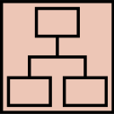

# Feedy UXD

## Abstract

This repository presents the comprehensive approach that went into designing **Feedy**, a mobile application aimed to enhance nutritional care. The app mainly focuses on addressing the challenges of **continuous follow-up** whilst improving patient adherence to dietary plans.

Within this space there are details of processes, strategies, user experience models, wireframes, mockups, **and more**. All assets created with User Experience (UX) fundamentals in mind.

The book **"The Elements of User Experience (2nd edition)"** by Jesse James Garrett was used as main reference.

## Team and Roles

- Benjamin Salamanca - Designer
  - Responsible on developing the user experience and user interface of the app.
- Nicolás Pacheco - Analyst
  - Focused on analysing and understanding the problem, and in ensuring that the solution is a good fit to effectively solve it.
- Nicolás Fernández - Expositor
  - Responsible of presenting and communicating the app's features and design to stakeholders. 
- Nicolás Paila - Project Manager
  - Responsible in overseeing the project's timeline, scheduling, and team coordination.

##  1. Strategy 

### Problem Statement
One of the most prominent challenges in nutritional care is the lack of **continuous follow-up** between nutritionists and their patients.

In practice, most nutritionists don't have a real-time system to track their patients' progress. Typically, patients are provided with a set of dietary recommendations and nutritional guidelines, but ongoing communication between the professional and the patient is limited to pre-scheduled, in-person consultations.

This situation presents several issues:

- From the **patient's perspective**, there is no immediate way to get assistance or clarification on their dietary plan as challenges or questions arise during the course of treatment.

- From the **nutritionist's perspective**, understanding patient progress is limited to sporadic appointments, making it difficult to gauge how well patients adhere to the prescribed plan or to provide timely adjustments to their treatment

### User needs:

- **Professionals’ perspective:**
  - “I want to know how my patients are progressing.”
  - “I want to know how well my treatments are being followed” → understand adherence to the treatment.
  - “I want to improve the quality of my care.”

- **Patients’ perspective:**
  - “I have a question about my treatment and I don't know how to communicate with my nutritionist.”
  - “I don’t have the ingredient mentioned in my recipe, and I don’t know what would be a good substitute. I want to ask my nutritionist.”

### Identified users:

- **Patients**: People who seek care from nutritionists. The reasons for seeking care include: eating disorders, medical problems with a nutritional origin, starting diets, weight-loss programs, and more.
- **Nutritionists**: Professional doctors who provide healthcare and treatments in the areas of nutrition and dietetics.

### Interview with Nutritionists

As part of the user research process we interviewed two nutritionists on key points related to their day-to-day workflow.

[Interview with Constanza](./assets/1.%20Strategy/Nutritionist%20Interview%20-%20Constanza)

[Interview with Bárbara](./assets/1.%20Strategy/Nutritionist%20Interview%20-%20Barbara)

---

### Solution
The solution is **Feedy**, a digital platform that facilitates continuous communication and tracking between nutritionists and their patients, ensuring more effective treatment follow-ups.

This platform enables nutritionists to manage, monitor, and support their patients throughout their treatment journey. Patients, in turn, can use the platform to log their progress, and stay in touch with their nutritionist, receiving guidance whenever needed.

### Product objectives:

- Enhance continuous monitoring of nutritional treatments
- Simplify patient management for nutritionists
- Increase adherence to nutritional plans

### Value Proposition Canvas

### UX Personas

#### Nutritionist

#### Patients

##  2. Scope 

### Functional Requirements

A detailed list of the main functionalities the platform aims to provide.

1. **Nutritional Plan Manager**

   - **1.1. Management of nutritional plans**:  
     Nutritionists will be able to create and customize meal plans for their patients. Each plan will include:
     - Specific nutritional requirements (calories, macronutrients, micronutrients, etc).
     - Food and meal recommendations.

   - **1.2. Plan Adjustments and Updates**:  
     Nutritionists can modify existing nutritional plans and send them to patients in real time.

   - **1.3. Plan Delivery and Notification**:  
     Patients will receive a notification on the platform when a new plan or modification is sent by their nutritionist.

2. **Tracking and Data Analysis Tools**

   - **2.1. Daily food intake logging**:  
     Patients can easily record their daily meals either manually or by selecting predefined options within the platform.

   - **2.2. Progress visualization**:  
     Patients and nutritionists will be able to view graphs and reports on the adherence to the nutritional plan, changes in weight, body measurements, calorie intake, and other parameters.

   - **2.3. Real-time data analysis**:  
     Nutritionists will have access to reports showing their patients' daily or weekly progress. These reports will include information such as:
     - Adherence to the plan.
     - Calorie intake.

3. **Patient Management Module**

   - **3.1. Patient Management**:  
     Nutritionists can view and manage all their patients from a unified control panel. They will have access to information such as:
     - Medical history.
     - Progress in treatment.
     - Latest food intake logs.

### Customer Journey Map

A vision on what it is hoped a patient user should experience throughout the use of the application.

### Benchmark

##  3. Structure

## Evolution of Interfaces

### 1. First Iteration — Wireframes

Following the scope and structure planes a first set of low-fidelity wireframes where created in order to despict the core functionalities of the system.

