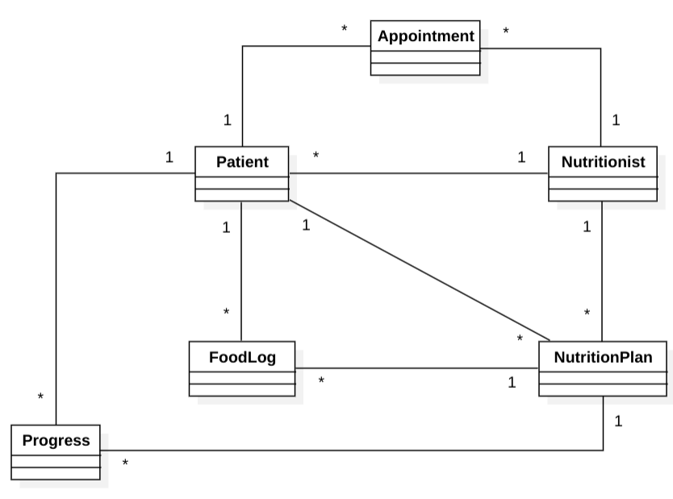

## Domain Model

This model aims to represent the main entities that interplay on the solution space of the project.

Works as a guide on the development and modeling of UI components' information/content requirements.

